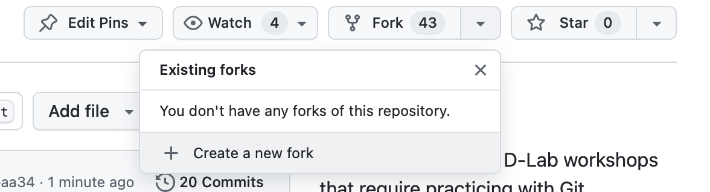
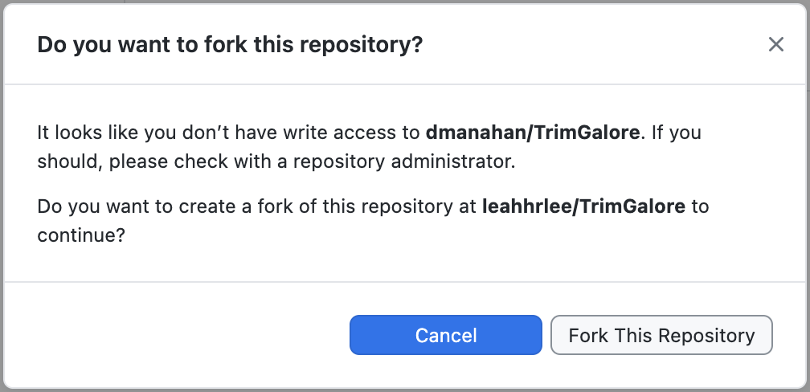

# GitHub Desktop Fundamentals
---
**_Learning Objectives_:**  
1. Understand why we use version control, Git, and GitHub
2. Learn basic terms used in GitHub, such as clone, commit, push, pull, and merge
3. Learn how to clone repositories, make changes, and update changes on local and remote repositories
4. Handle branches and resolve merge conflicts 
 ---
### Icons Used in This Notebook 
🔔 **Question**: A quick question to help you understand what's going on. 
🥊 **Challenge**: Interactive excersise. We'll work through these in the workshop! 
💡 **Tip**: How to do something a bit more efficiently or effectively. 
 ⚠️ **Warning:** Heads-up about tricky stuff or common mistakes. 
📝 **Poll:** A Zoom poll to help you learn! 
🎬 **Demo**: Showing off something more advanced  
 
## Version Control 
 🔔**Question**: Have you ever made a mistake of overwriting a file or saving the wrong version? 
 
> Imagine that you’re collaborating with one of your labmates on a project. You’re both making changes to a document or a codebase. At one point, you both have changed the same lines in a particular document. How do you go about merging your changes?

This is why we use version control. **Version control** is a system that manages and records changes to files over time. The most commonly used version control system is called **Git** (others include Mercurial and SVN). Git keeps track of the differences in the repository each time you make a change. The entire history of the repository is tracked by Git. If you realize you made a mistake in your code, you can always roll it back to a previous time point.

If you have used Google Docs, you likely have already used version control. Google Docs now tracks every change that every user makes, and allows you to go to any version of the document. Git allows us to do the same thing in complex code environments.

## Git Workflows: Personal Workflow
There are a variety of workflows you may employ when using Git to track your changes. The most common, particularly for academic settings, is the **personal workflow**.

 

In the personal workflow, you are largely going to be the only person adding to the repository. You have one **branch**, or version of your project. It is called the `main` branch. Every time you make changes to the code, you'll add them to the `main` branch. 

The main goal with version control settings is keeping track of the changes that you, the main user, are making to your repository. You don't have to worry about handling multiple people working on the repository at once, which simplifies the workflow. This is the first setting we will work in for this workshop.

## GitHub
Git is often used in tandem with a cloud-based hosting platform - the most common is **GitHub** (but others include Gitlab and Bitbucket). GitHub is a hosting service for Git repositories. It allows you to store your Git projects in the cloud and provides a platform for collaborating with others. The benefit to using GitHub is that it makes it easier to collaborate on code with others via its web platform. 
 
In this lesson, we're going to use the [**GitHub Desktop Application**](https://desktop.github.com/download/) to make updates to a repository. [The documentation for GitHub Desktop](https://docs.github.com/en/desktop) is available online.  

A **repository** (or repo for short) is a central place where all the files related to a project are stored. It includes your project’s code, documentation, and a record of every change made to the files over time, managed through a version control system like Git.  

💡**Tip**: Git and GitHub can be used through command line. We are focusing on GUI version of GitHub. 

## Managing Local and Remote Repositories
We need to make a distinction between two kinds of repositories: there's the local repository and the remote repository. **The local repository** is the version of the code that is stored on your computer. **The remote repository**, meanwhile, is any version of the repository that lies on some other machine. In this context, remote repository is almost always going to refer to the version that is on on GitHub's servers.  

So, when we're making changes to a repository, there's two versions that need to stay in sync with each other: the local and the remote. The steps we outline keep track of those changes between both cases, while also keeping track of the entire history. GitHub provides a nice platform on which we can peruse the history of a repository. 
  

1. **Commit**: Save your selected changes with a description.
2. **Push**: Upload your saved changes to GitHub for others to see.
3. **Pull**: Download the latest updates from GitHub to your project.
 
Let's go through the process of making changes to a repository, step by step. 
 
### 1. Creating a Repository 
To create a new repository on GitHub, click on this [link](https://docs.github.com/en/get-started/quickstart/create-a-repo) and follow the instructions. Make sure to tick the `Add a README file` box under "Initialize this repository with". Click on `Create repository`. You now have a remote    repository (on GitHub's servers), but **not** a local repository. 

To create a new repository on GitHub Desktop, click `Current Repository`, and `add`. Click `Create New Repository`. Make sure to tick the "Initialize this repository with a README file". You now have a local repository but **not** a remote repository. `Publish repository` in order to put this newly created repository onto GitHub.  

🥊**Challenge**: Let's create a new repository under your account.  

### 2. **Making a Change** 
GitHub Desktop automatically tracks changes. Whenever you make changes to the local repository, the changes will how up on the application.  

Let's make a change by creating a new file. Create a file called `text.txt`, which has some text in it of your choosing. 

🔔**Question**: Do you see these changes on your GitHub Desktop? 
 
### 3. **Committing a Change** 
Committing changes entails taking a snapshot of them: once we do this, the changes are frozen and placed in the `git` history. Each commit needs an accompanying message to say what the reason for the commit is. Make sure these messages are informative - your future self will thank you! 

### 4. **Pushing to the Remote Repository** 
Right now, the local repo knows about the changes we did, but the remote repo doesn't. So, we need to synchronize the two by "pushing" our changes to the remote repo.  

### 5. Check GitHub
Let's check the GitHub page to see if the changes you made manifest on the website!  

### 6. Make Edits and Commits on GitHub Directly
Let's make changes to the remote repository by making changes GitHub page directly.  

So, even in the personal workflow, there's a lot of individual steps needed just to make changes to the codebase. This becomes a little bit more complicated when multiple people are making changes at the same time, which requires a slightly different workflow. 

🎬 **Demo**: We will make two different edits both on remote and local repositories. What happens when you try to merge these two repositories?
 
## GitHub Workflows: Collaborative Workflow  
In the collaborative workflow, multiple people may be working on the same repository at the same time. So we need to have a system in place for how to decide whose changes to add, and how to handle scenarios when changes may clash with each other. 
 
Collaborative workflows heavily rely on **branching**. A branch in Git (and GitHub) is a separate line of development within a repository. It allows you to work on new features, bug fixes, or experiments without affecting the main codebase. We've already seen this terminology in the context of the `main` branch.   

Think of branches like **alternate versions** of the same folder. When you switch to a new branch, the files on your computer instantly change to match that version. It’s like flipping between parallel universes of your project, where each one has different contents.
 
Now, we might be interested in adding a new feature to a code repository. When working collaboratively, we create a **branch** off the `main` repository. This branch can be updated in parallel, without modifying the `main` branch. When we've committed all the changes to the feature branch, how do we go about incorporating them into the`main` branch?  

 **Forking** in GitHub is the process of creating a personal copy of someone else's repository in your GitHub account. It allows you to freely make changes without affecting the original repository.  
* **Branches** are within the same repository. Branches make it easier collaboration among team members who have access to the repository.  
* **Forks** create a completely separate copy of the repository, which is useful for outside contributors.

 
 
### 1. **Forking the Repository** 
An extra step you can take when working on a collaborative repository is to **fork** the repo. This creates a copy of the repository on your own GitHub account, which you're free to change at will. You can still, however, pull changes from the original repo, and make pull requests with your own changes. Go ahead and fork the repo [`Git-Playground`](https://github.com/dlab-berkeley/Git-Playground). See the image below for where to find the button: 
 

 If you try to commit on a repository that you don't have access to, GitHub Desktop will ask you to create a fork.   

  

### 2. **Cloning** 
Cloning a repository means taking a remote repository, and copying it to our local machine to create a local repository. Under `Current Repository`, click `add` and select `Clone Repository`. You can clone your own repository or any publically avaialable repository.  
For this section, clone the forked repo of `Git-Playground` to your local machine. Make sure you click `To contribute to the parent project`  

### 3. **Branching** 
Create a new branch on your local machine. On GitHub Desktop, you can do this by clicking on `Current Branch`. Under `Branches`, there is button with `New Branch`.  Choose a branch name that feels appropriate to you. 
 
### 4. **Commit a Change** 
Create a new file with some text, stage it, and commit it. 

### 5. **Push the Change** 
Push the change on this branch to your remote repo.  

🎬 **Demo**: We will make two different edits both on `main` branch and your new branch. What happens when you try to merge these two branches with conflicts?

### 6. **Make the Pull Request** 
To merge our changes into the original repository, we do a **Pull Request** (PR). In a PR, we are requesting the `main` branch to pull the changes from the feature branch into the `main` branch. 

GitHub provides a very nice platform to handle PRs - users can view the PRs, comment on them, and ask for changes. Once the maintainer of the repo is satisfied, they can merge the PR and the `main` branch is updated with the changes in the feature branch. 
 
The process of merging the changes in this way allows people to work in parallel on the `main` repo without modifying the `main` branch. Couple this with GitHub's platform for handling PRs, and you have a powerful tool for incorporating parallel changes into a repository. 
 
Let's give this a shot! You are going to make a change to an existing repository and submit a pull request for it. 
 
Go to your forked `Git-Playground` repository on GitHub. GitHub can already tell you made a change, and gives you the option to make a pull request! Click `Contribute` andn `Open pull request`. If you don't see this button, no worries - go to the "Pull Requests" button next to Issues, and you can manually make one there. Follow the instructions for making the pull request, and we'll merge a couple of them! 

# Removing git repositories 
 
* **Local:** If you want to delete local git-related information (like branches and versions), all you have to do is delete the `.git` directory in the root-directory of your repository. Note that `.git` directories are hidden  by default, so you'll need to be able to view hidden files to delete it.  If you want to delete everything (data, code, etc.), just delete the whole directory. 

In GitHub Desktop, you can delete branches by right-clicking on a branch name in Branches and selecting "Delete.." 
 
* **Remote:** If you want to delete a remote repository, navigate to GitHub and go to Settings, then Danger Zone (at the bottom of the Settings page). Warning:Once you delete a repository, there is no going back. 
 
# Key Points
 There are several different workflows in which you might imagine using `git` and `GitHub`, particularly in an academic setting. These include: 
 
1. Working on a repository that is your own repo. You expect that you will generally be the only person developing code for this repository.  
2. Working on a repository that several people - perhaps some collaborators - are working on concurrently.  
3. Working on a repository that *many* people (e.g., at least dozens) are involved in. This may be, for example, an open-source project to which you contribute changes. We will not cover this approach in this workshop, as the details may be specific to the project you're working on. However, the principles from approach #2 hold here. 
