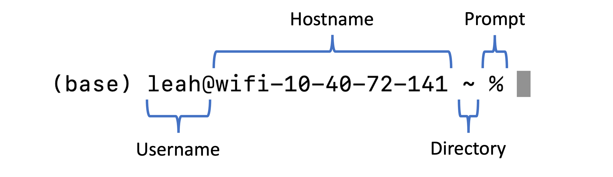

# Command Line Lesson
📝 **Poll**: What operating system do you use? Have you used command line? If yes, what program did you use? 

---
**_Learning Objectives_:**  
1. Understand the role of the command shell in operating system interactions.
2. Navigate directories and paths effectively.
3. Create, move, and delete files and directories.
4. Use search and filter commands to locate and process files.
5. Work with pipes, redirection, and basic text processing.
6. Prepare to automate simple tasks using bash scripts.
---

## 1. Introduction to Command Line

### What is Command Line?

A **command line**, or a command-line interface (CLI), is a way to interact with a computer using lines of text. <br>
**Terminal** is a type of command line interface. It is a software that can print text to your screen and accept keyboard input. <br>
<br>
For Linux and Mac OS, Terminal program is pre-installed.  <br>
For Windows, there are multiple programs you can install to use BASH. Here is [the installation instruction](https://gitforwindows.org) for `Git for Windows`. There are other programs, such as [Windows Subsystems for Linux(WSL)](https://ubuntu.com/desktop/wsl) you can use on the Windows OS. <br>
We will not use `PowerShell` on Windows. PowerShell is a scripting environment that has its own syntax. <br>

### What is Shell? 
**Shell** is a programing language we will use to interact with the computer. We can think of terminal as the interface we are using and shell as the language we are using on that interface. We often call it shell scripting language.<br>
<br>
**Bash**(The **B**ourne **A**gain **SH**ell) is a type of shell scripting language. <br>
Your terminal might run a **bash** shell, which is one of the most commonly used shells. There are others shell scripting language. For example, **zsh** or Z shell is starting to be rolled out by default on Macs. At this point, the differences will not matter for this workshop.<br>
<br>

💡 **Tip**: `ps` will tell you what kind of shell you are using<br>

### Why and when to use command line? 
🔔 **Question:** Why are you here? Why do you want to learn how to use command line?<br>
<br>
Command line is more **powerful, flexible,** and **productive** than graphical interfaces for many tasks: <br>
- Complex tasks with a few commands or scripts <br>
- Direct access to system functionality<br>
- Better for remote operations (e.g., managing servers) <br>
- Powerful utilities like grep, find, and sed<br>
- Chain tasks together with pipes (|) and redirection (>) <br>
<br>
🎬 **Demo:** For example, I can save a list of files with a certain pattern in a text file. By the end of the workshop, you will be able to do this!

---

## 2. Accessing the Command Line
Let's open a Command-Line Interface of your choice. For Mac and Linux, you can find Terminal in the Applications folder. <br>

🔔 **Question:** When you turn on the Terminal / CLI of your choice, what does the last line of text say? <br>
<br>
What you see is in the format of: 
**Username @ Hostname Directory $** <br>
<br>


Your prompt shows where you are in the system. The dollar sign ($) indicates where your input starts. The rectangular block is your cursor.<br>

### Basic Structure of a Command
**Command Syntax: `[command] [options] [arguments]`**
- **Command**: The program you want to run (e.g., ls).
- **Options/Flags**: Modify the behavior of the command (e.g., -a for ls).
- **Arguments**: Input files, directories, or additional data (e.g., ls /home/user).

---

## 3. Navigating File system

### Working Directory
🔔 **Question:** Type `pwd` and press enter. What output did you get? <br>

* `whoami`: Print the current user.
* `pwd`: Print the **p**resent **w**orking **d**irectory.
* `ls`: List the files in the working directory.
* `ls -lh`: List files with details and human-readable sizes.

💡 **Tip**: at any point, you can press `TAB` to autocomplete a partially completed command. <br>

### Changing Directories

* `cd folder_name`: Move to the `folder_name` folder.<br>
* `cd ..`: Move to one directory above our current location.<br>
* `cd ~`: Move to your home directory.<br>
* `cd -`: Go back to the previous directory.<br>

**File paths** specify locations:<br>
* **Absolute paths** start with `/` (from root directory)
* **Relative paths** don't start with `/` (from current directory)

🥊**3-1**: Navigate to the downloaded workshop folder, then go into `bash_lab/data`, then back home using `cd ~`. <br>

### Reference: Keyboard Shortcuts

The command line can feel archaic, but remembering some keyboard shortcuts can help you speed things up.

* **Navigation**: Up/down arrows for command history
* `Ctrl-C`: Stop current command
* `Ctrl-L`: Clear screen
* `Ctrl-A`: Go to start of line
* `Ctrl-E`: Go to end of line
* `Ctrl-R`: Search through your command history interactively.
* `Option-Arrow Keys`: Move the cursor word by word instead of character by character.
* `Ctrl-U`: Delete everything on the line before the cursor.
* `Ctrl-K`: Delete everything on the line after the cursor.
* `Tab`: Autocomplete filenames and commands

---

### Finding Files with `find`
The `find` command searches for files and directories recursively:<br>

```bash
find . -name "*.csv"              # Find all CSV files from current directory
find bash_lab/data -name "*.log"  # Find all log files in bash_lab/data
```

💡 **Tip:** Always quote patterns: `-name "*.csv"` not `-name *.csv`<br>

🥊**3-2**: Use `find` to list all `.csv` files in the `bash_lab/data` directory.<br>

---

## 4. Create, Move, and Delete Files

### Creating Files and Directories
* `mkdir folder_name`: Create a new directory
* `mkdir -p path/to/folder`: Create nested directories (creates parent dirs if needed)
* `touch file.txt`: Create an empty file

🥊**4-1**: Create a folder called `test_folder` and a file called `notes.txt` inside it.<br>

### Wildcards
The `*` wildcard matches any characters:<br>
```bash
ls *.txt          # List all .txt files
rm *.tmp          # Remove all .tmp files
cp *.csv backup/  # Copy all CSV files to backup folder
```

### Copying and Moving
* `cp source destination`: Copy a file
* `cp -r folder destination`: Copy a folder (recursive)
* `mv source destination`: Move or rename

🥊**4-2**: Copy `notes.txt` to the parent directory, then rename it to `notes_backup.txt`.<br>

### Removing Files
* `rm file.txt`: Remove a file
* `rm -r folder`: Remove a folder and its contents
* `rm -f file.txt`: Force removal (no confirmation)

⚠️ **Warning:** Be careful with `rm` - there's no trash/recycle bin!<br>

🥊**4-3**: Remove the `test_folder` and all its contents.<br>

---

## 5. Viewing and Searching Files

### Viewing Files
* `cat file.txt`: Display entire file
* `less file.txt`: Page through file (press `q` to quit)
* `head -n 10 file.txt`: Show first 10 lines
* `tail -n 10 file.txt`: Show last 10 lines

🥊**5-1**: View the first 5 lines of any `.csv` file in `bash_lab/data`.<br>

### Counting Lines
* `wc -l file.txt`: Count lines in a file
* `wc -l *.txt`: Count lines in all .txt files

### Searching with `grep`
`grep` searches for text patterns in files:<br>

Basic options:<br>
- `-i`: Case-insensitive search
- `-n`: Show line numbers with matches

```bash
grep "error" log.txt                # Find lines containing "error"
grep -i "error" log.txt             # Case-insensitive search
grep -in "error" *.log              # Search all .log files, show line numbers
```

🥊**5-2**: Search for "ERROR" (case-insensitive) in all files in `bash_lab/logs/` and show line numbers.<br>

### Editing Files with nano
`nano` is a simple text editor:<br>

```bash
nano file.txt
```
- Type to edit
- `Ctrl + O`: Save
- `Ctrl + X`: Exit

🥊**5-3**: Create a file called `todo.txt` and add 3 items to it using nano.<br>

---

## 6. Text Replacement with `sed`

The `sed` command can find and replace text in files:<br>

Basic syntax: `sed 's/old/new/g' file.txt`<br>
- `s`: substitute
- `old`: text to find
- `new`: replacement
- `g`: replace all occurrences

### Viewing changes (safe)
```bash
sed 's/http:/https:/g' file.txt     # Prints to screen, doesn't change file
```

### Editing files in place
**Linux:**
```bash
sed -i 's/http:/https:/g' file.txt  # Modifies the file directly
```

**macOS** (requires empty string):
```bash
sed -i '' 's/http:/https:/g' file.txt  # Modifies the file directly
```

💡 **Tip**: Always test with `grep` first to see what will be changed!<br>

🥊**6-1**: Replace all instances of "http:" with "https:" in files in `bash_lab/docs/`.<br>

---

## 7. Pipes, Redirection, and Combining Commands

### Redirection
Save command output to files:<br>
* `>`: Redirect output (overwrites file)
* `>>`: Append output (adds to file)

```bash
ls > filelist.txt           # Save file list
echo "New item" >> todo.txt # Add to existing file
```

### Pipes
The pipe `|` sends output from one command to another:<br>

```bash
ls | grep ".txt"                     # List files, filter for .txt
find . -name "*.log" | wc -l        # Count how many .log files
```

### Understanding `xargs`
Many commands don't accept piped input. `xargs` converts piped input into command arguments:<br>

```bash
find . -name "*.txt" | grep "hello"        # ❌ Wrong - grep expects filenames as arguments
find . -name "*.txt" | xargs grep "hello"  # ✅ Right - xargs passes filenames to grep
```

🥊**7-1**: Use `find` and `xargs` to search all `.txt` files for the word "TODO".<br>

---

## 8. Handling Spaces in Filenames

Spaces in filenames need special handling:<br>

### Simple approach: Use quotes
```bash
mv "My Document.txt" My_Document.txt
cat "File with spaces.txt"
```

### Batch renaming (safe method)
To rename all files with spaces to use underscores:<br>
```bash
# First, preview what has spaces
find . -name "* *"

# Then rename safely
for file in *\ *; do
  mv "$file" "${file// /_}"
done
```

🥊**8-1**: Find all files with spaces in `bash_lab/docs/` and list them.<br>

---

## 9. User Input and Basic Scripts

### Getting User Input
The `read` command gets input from users:<br>

```bash
read -p "Enter your name: " name
echo "Hello, $name!"
```

### Creating a Script
1. Create a file with commands:
```bash
#!/usr/bin/env bash
echo "This is my script"
date
ls
```

2. Make it executable:
```bash
chmod +x myscript.sh
```

3. Run it:
```bash
./myscript.sh
```

The `#!/usr/bin/env bash` line (shebang) tells the system to use bash.<br>

🥊**9-1**: Create a script that asks for a filename and then counts its lines.<br>

---

## 10. Practical Examples

### Example 1: Backup logs
```bash
mkdir -p backups
cp logs/*.log backups/
echo "Backed up $(ls backups/*.log | wc -l) files"
```

### Example 2: Find and archive old files
```bash
find . -name "*.tmp" -type f | xargs rm
```

### Example 3: Search logs for errors
```bash
grep -in "error" logs/*.log > error_report.txt
echo "Found $(wc -l < error_report.txt) error lines"
```

### Passing files to Python
When you need more complex processing, find files with bash and process with Python:<br>
```bash
find data -name "*.json" | xargs python process.py
```

---
**_Key Points_:**  
1. Command line is powerful for file management and text processing
2. Core navigation: `pwd`, `cd`, `ls`
3. File operations: `cp`, `mv`, `rm`, `mkdir`, `touch`
4. Finding and searching: `find`, `grep`, `wc -l`
5. Text editing: `nano` for interactive, `sed` for batch changes
6. Combine commands with pipes (`|`) and redirection (`>`)
7. `xargs` bridges commands that need filename arguments
8. Scripts automate repetitive tasks
---
