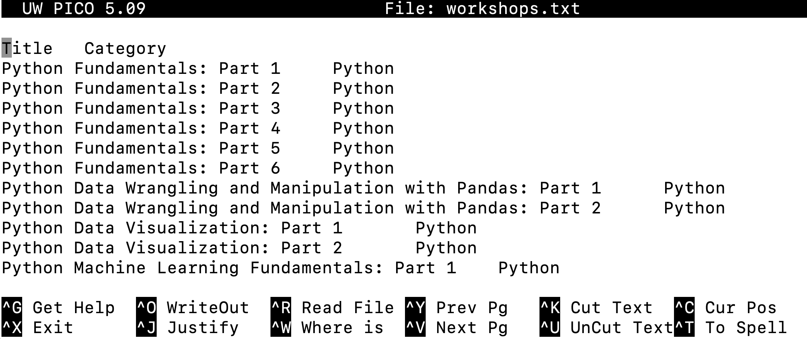

# D-Lab Command Line Workshop
📝 **Poll** {Command Line}{1-1}: What operating system do you use? Have you used command line? If yes, what program did you use? 

---
**_Learning Objectives_:**  
1. Understand the role of the command shell in operating system interactions.
2. Understand and navigate through directories and paths.
3. Use command line for creating, moving, and deleting files and directories.
4. Apply pipes and redirection to combine commands.
---

## 1. Introduction to Command Line

### What is Command Line?

A **command line**, or a command-line interface (CLI), is a way to interact with a computer using lines of text. <br>
**Terminal** is a type of command line interface. It is a software that can print text to your screen and accept keyboard input. <br>
<br>
For Linux and Mac OS, Terminal program is pre-installed.  <br>
For Windows, there are multiple programs you can install to use BASH. Here is [the installation instruction](https://gitforwindows.org) for `Git for Windows`. There are other programs, such as [Windows Subsystems for Linux(WSL)](https://ubuntu.com/desktop/wsl) you can use on the Windows OS. <br>
We will not use `PowerShell` on Windows. PowerShell is a scripting environment that has its own syntax. <br>

### What is Shell? 
**Shell** is a programing language we will use to interact with the computer. We can think of terminal as the interface we are using and shell as the language we are using on that interface. We often call it shell scripting language.<br>
<br>
**Bash**(The **B**ourne **A**gain **SH**ell) is a type of shell scripting language. <br>
Your terminal might run a **bash** shell, which is one of the most commonly used shells. There are others shell scripting language. For example, **zsh** or Z shell is starting to be rolled out by default on Macs. At this point, the differences will not matter for this workshop.<br>
<br>

💡 **Tip**: `ps` will tell you what kind of shell you are using<br>

### Why and when to use command line? 
🔔 **Question:** Why are you here? Why do you want to learn how to use command line?<br>
<br>
Another way to interact with a computer is through a graphical user interface (GUI), a way for users to interact with electronic devices using visual indicators and graphical icons.
Interacting with computers with command line could be more **powerful, flexible,** and **productive**: <br>
- CLI allows complex tasts with a few commands or scripts. <br>
- CLI gives direct access to the underlying system functionality.<br>
- CLI consumes fewer system resources compared to GUI applications, making it more flexible for remote operations (e.g., managing a server over SSH). <br>
- Many powerful utilities like grep, awk, sed, ssh, rsync, and system-wide package managers are accessible via CLI and provide functionalities often unavailable or restricted in GUIs.<br>
- CLI tools often allow users to combine multiple commands using pipes (|) and redirection (>, <) to chain tasks in creative ways. Users can customize workflows through scripts to suit their specific needs. <br>
<br>
🎬 **Demo:** For example, I can save a list of files with a certain pattern in a text file. By the end of the workshop, you will be able to do this!


---

## 2. Accessing the Command Line
Let's open a Command-Line Interface of your choice. For Mac and Linux, you can find Terminal in the Applications folder. <br>

🔔 **Question:** When you turn on the Terminal / CLI of your choice, what does the last line of text say? <br>
<br>
What you see is in the format of: 
**Username @ Hostname Directory $** <br>
<br>


The anatomy of a basic terminal prompt is simple: you'll usually have a username (leftmost) followed by an at symbol (@), followed by the hostname (a fancy way of saying what machine you're on), and then a prompt, which might be a dollar sign followed by a rectangular block. The dollar sign (or whatever prompt symbol is there) indicates where user input starts. The rectangular block is your cursor.<br>

Your prompt might not look like this! Some prompts can be pretty fancy, and contain a lot of useful information to the user. The only thing that matters right now is entering input.<br>

### Basic Structure of a Command
**Command Syntax: `[command] [options] [arguments]`**
- **Command**: The program you want to run (e.g., ls).
- **Options/Flags**: Modify the behavior of the command (e.g., -a for ls).
- **Arguments**: Input files, directories, or additional data (e.g., ls /home/user).


---

## 3. Navigating File system

The shell allows us to interact with our file system in different ways: navigating through our folders, creating new files, editing existing ones, etc. First we need to understand which directory we are currently in.

### Working Directory
🔔 **Question:** Type `pwd` and press enter. What output did you get? <br>

* `whoami`: Print the current user.
* `pwd`: Print the **p**resent **w**orking **d**irectory.
* `ls`: List the files in the working directory.

What's the working directory? At any given point in a terminal, we'll be located in a particular spot in our filesystem. This location can be identified by the series of folders we need to look into to get there. The working directory is our current location.

💡 **Tip**: at any point, you can press `TAB` to autocomplete a partially completed command. <br>


### Changing Directories

Being in this folder is nice, but what if we wanted to move to another location?<br>
Luckily, there's a command for that: **cd**, for  **c**hange **d**irectory. But there are several ways to use `cd`.<br>

1. `cd ..`: This is moving to one directory above our current location.<br>
2. `cd folder_name`: This is moving to the `folder_name` folder.<br>
3. `cd ~`: The tilde `~` is just shorthand for the **home** directory.<br>

A chain of folders that specifies a location is called a **file path**. There are two ways of specifying file paths:<br>

* **Absolute file paths** are relative to the **root directory**, which is the uppermost level of a file system. Absolute file paths always start with a forward slash `/`. <br>
* **Relative file paths** are relative to your working directory. These paths start with no forward slash or a `./` (the period is shorthand for the working directory). <br>

In specifying file paths, you can use the `~` as a shorthand for your home directory.<br>
🥊**3-1**: Let's navigate to the downloaded workshop folder. <br>


---

## 4. Create, move,and delete files and directories
### Creating Directories and Files
To make new directories and files, we use `mkdir` and `touch`<br>
* `mkdir test`: This will make a new directory called `test`. <br>
* `touch test.txt`: This will create a file named `test.txt`.<br>

🥊**4-1**: Make a folder with a different name. Make a text file within the folder.<br>

To copy or move files and directories, we use `cp` and `mv`. <br>
* `cp file_name destination`: Copy and paste. There are two arguments here: the source and the destination. <br>
* `cp -r`: Bash commands sometimes come with **flags**, which are additional specifications to how we run the command. Flags are always preceded by one or two dashes. The `-r` flag for `cp` indicates we should do a recursive copy. This is specifically for folders, which may have multiple copies to do.<br>

🥊**4-2**: Copy `test.txt` to the `solutions` folder.  <br>
* `mv`: Moving a file is just like copying, but it does not leave a version in the source. Create a file called `test2.txt` and move it to the `img` folder.<br>

🥊**4-3**:  Rename a `test.txt` file using mv to `test2.txt`<br>
🥊**4-4**:  Move the `test2.txt` file to a different directory (for example: `images`).<br>

To remove files and directories, we use `rm`. <br>
* `rm`: Removing a file. Use the `-rf` flag for folders: this is the `-r` flag (recursive) and `-f` flag (force the removal) combined.<br>

🥊**4-5**:  Navigate to `solutions`, and remove `test.txt`.<br>
🥊**4-6**:  Navigate to `imgages`, and remove `test2.txt`.<br>

⚠️ **Warning:** DO NOT EVER DO `rm -rf`. This will remove everything from your computer.<br>


#### Wildcard (*)
The wildcard `*` in the command line is a symbol used to represent any number of characters in file or directory names. It helps match multiple files or directories without specifying their full names. For example, `*.txt` would match all files ending with `.txt`, and `file*` would match all files starting with "file," regardless of what comes after (e.g., `file1`, `file2`, `file_name`). <br>

This is useful for handling multiple files or directories at once in commands like `ls`, `rm`, `cp`, and more.<br>

| Instruction                          | Command Example                    |
|--------------------------------------|------------------------------------|
| Match any characters in filenames    | `ls *.txt` (lists all `.txt` files)|
| Match all files starting with "file" | `rm file*` (removes all files starting with "file") |
| Match all files in a directory       | `cp * /destination` (copies all files to destination) |

---

## 5. Viewing and Editing Files

How can we view files? This depends on the type of file we're working with, which is specified by the extension. Most files we'll work with are composed of some kind of text such as `.txt` files, `.py` files, `.R` files, etc. Here are some approaches to view their contents quickly:<br>

* `cat`: View all the contents of a file. This command is short for "concatenate", because it can be applied to multiple files.
* `less`: This is useful when your file is too big for `cat`, and you quickly just want to see a small portion of it.

Let's move to `data` folder and use `cat` and `less` to read `workshops.txt` file. <br>
🔔 **Question:** When should we use `less` instead of `cat`? <br>
💡 **Tip**: `Ctrl-C` will abort process. This shortcut comes in very handy!
These commands are useful for quickly viewing files, but how about editing
files? There are several programs in bash you can use to do this: `vim`, `nano`,
and `emacs` are some examples.

We will try using `nano` to read and edit files. First we will open `workshops.txt` file with nano.

```
nano workshops.txt
```
This is what the command line interface with Nano looks like:
<br>

<br>

1. **Open a file**: `nano filename.txt' to open up a file called `filename.txt`.
2. **Edit text**: Start typing to edit the file directly. Use arrow keys to move the cursor. 
3. **Save your changes**: Press `Ctrl + O` (WriteOut) to save. You will be prompted to confirm the file name. Press `Enter` to confirm. 
4. **Exit `nano`**: Press `Ctrl + X` to exit. <br>

🥊**5-1**:  Open `Workshops.txt` and add this workshop to the list of workshops.<br>


---

## 6. Dealing with outputs: Pipes and redirection
One of advantages of using the command line interface is the flexibility in interacting with the coputer when doing complex tasts. Redirection and pipes are two important operaters that allow simplifying workflows and automating tasks. 
* **Redirection** (`>`, `>>`): Sends the output of a command to a file. `>` redirects output and verwrites the content of the specified file. `>>` appends the output to the end of the specified file without overwriting its existing contents. It also creates the file if it does not exist. 
* **Pipes** (`|`): Connects the output of cone command to the input of another. <br>

🥊**6-1**:  save a list of files in the working directory as “filenames.txt”

[`grep`](https://www.gnu.org/software/grep/manual/grep.html) is a command in Linux. It stands for "**G**lobal **R**egular **E**xpression **P**rint" and is used to search for specific patterns of text within files or the output of other commands. `grep` is a powerful tool for text searching and pattern matching, making it essential for analyzing and filtering data in the terminal. <br>

Let's try using `grep` on `workshops.txt` files. 
```
grep "Python" workshops.txt
```
🔔 **Question:** What happens if you intput 'python' instead of 'Python'? <br>

🥊**6-2**: Let's obtain list of files from a directory, search for filenames that include "pdf", and save that list as `pdffiles.txt`. Try to do this in one line of code. <br>

---
**_Key Points_:**  
1. We use the command line interface because it can be more powerful and flexible than using a graphical user interface (GUI).
2. A basic BASH command consists of a command name, options (flags), and arguments.
3. Key commands like pwd, cd, ls, mkdir, and rm help navigate and manage files in the system.
4. Redirection (>, >>) and piping (|) allow users to manipulate the input and output of commands efficiently.
5. Combining commands and using wildcards allows for more advanced file operations and task management.
---

## Reference: Keyboard Shortcuts

Here are some keyboard shortcuts you can keep in mind as you become more
familiar with bash:

* Up/down arrow keys: cycle through previous commands.
* `Option + `left/right arrow keys:* Move the cursor word by word.
* `Ctrl-C`: Abort process.
* `Ctrl-D`: Terminate input.
* `Ctrl-R`: Search previous input.
* `Ctrl-L`: Clear console.
* `Ctrl-A`: Move cursor to beginning of line.
* `Ctrl-E`: Move cursor to end of line.
* `Ctrl-K`: Cut to end of line.
* `Ctrl-U`: Cut to beginning of line.
* `Ctrl-Y`: paste.

